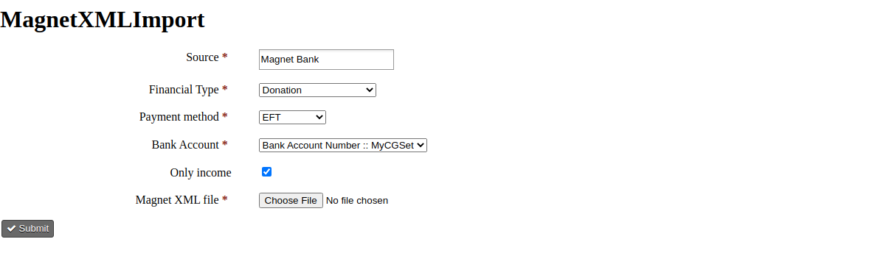
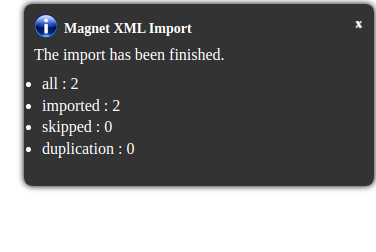

# magnet-xml-import

This extension lets you import contribution transactions from Magnet XML. It provides an administration interface where you can set the parameters of the contributions.

The extension is licensed under [AGPL-3.0](LICENSE.txt).

## Administration interface

The admin form can be reached from the `Contribution > Magnet XML Import` menu.



### The parameters

The `Source` parameter will be used as the value of the constribution source. You can add any text you want. The default value is `Magnet Bank`. Required.

The selected `Financial Type` will be set as the financial\_type\_id of the contribution. You can choose from the financial types provided by the system. The default value is `Donation`. Required.

The selected `Payment method` will be set as the payment\_instrument\_id of the contribution. You can choose from the payment methods provided by the system. The default value is `EFT`. Required.

The selected `Bank Account` will be used for the contact identification. This contact parameter has to store the bank account id of the contact. You can choose from the contact parameters provided bz the system. The default value is `custom_1` custom parameter. Required.

When the `Only income` checkbox is checked, the negative transactions will be skipped during the import process. The number of skipped transactions will be shown in the info popup after the import execution. By default it is `checked`.

The `Magnet XML file` is the upload field for the XML. It does not have default value. Required.

### The import workflow

- Navigate to the form from the `Contribution > Magnet XML Import` menu.


- Change the settings if necessary and upload the Magnet XML file.


- Submit the form.


- Check the statistics.



## How does it work

A successful form submission, triggers the execution of the Magnet XML import service. The Importer application uses the configurations described above and the uploaded XML file and returns detailed import statistics after the execution.

First it reads the file and loads it as XML object. The all parameter of the stats is the sum of the `Tranzakcio` tags. The import process iterates over the `Tranzakcio` tags and handles them one by one.

The Transformer class is responsible for the data transformation. It extracts and transforms the necessary contact and the contribution data from the transaction XML object. The data extraction was based on existing implementation and not on documentations.

When the `Only income` is set and the `total_amount` in the transformed contribution is not a positive number, it updates the skipped stat and continues the execution with the next transaction. The execution also continues with the next transaction if the current one is a duplication. In this case the duplication stat is increased. The transaction identifier is checked.

The Magnet provides only the bank account number as uniq identifier, so that the contact mapping is based on this. First it tries to find the contact with the given value of the `Bank Account` config. If the contact is not found and the given account number matches a pattern, then the number is transforms to IBAN like format and the previous contact get is tried again, but with the LIKE operator. If the contact still not found, a new one is created. If the contact is not found and we were not able to create a new contact, it continues the execution with the next transaction as a contact id is required for the contributions.

Finally it creates the contribution and increases the imported stat. When the import process is finished an info alert with the statistics is displayed.

## Requirements

* PHP v7.3+
* CiviCRM 5.37+

## Installation (CLI, Git)

Sysadmins and developers may clone the [Git](https://en.wikipedia.org/wiki/Git) repo for this extension and
install it with the command-line tool [cv](https://github.com/civicrm/cv).

```bash
git clone https://github.com/FIXME/magnet-xml-import.git
cv en magnet_xml_import
```
